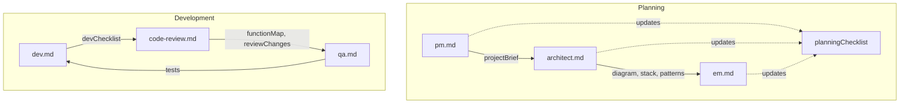

## Workflows: Planning and Development

This repository defines a multi-agent workflow for planning and development. It produces versioned and non-versioned artifacts designed to be consumed by other LLM agents and by humans.



### Planning Flow
- **Agents**
  - `pm.md` (Program Manager)
  - `architect.md` (Architect)
  - `em.md` (Engineering Manager)

- **Versioning convention**: Iteration-scoped artifacts use the prefix `iteration{N}-...` (e.g., `iteration1-projectBrief.md`).

- **Artifacts produced**
  - **pm.md**:
    - `artifacts/planning/iteration{N}-projectBrief.md`
    - Appends entry to `artifacts/planning/iteration{N}-planningChecklist.md` (creates file if missing)
  - **architect.md**:
    - `artifacts/planning/iteration{N}-architecturalDiagram.md`
    - `artifacts/planning/iteration{N}-techStack.md`
    - `artifacts/planning/iteration{N}-implementationPatterns.md`
    - Appends entry to `artifacts/planning/iteration{N}-planningChecklist.md`
  - **em.md**:
    - `artifacts/development/iteration{N}-epic.md`
    - Appends entry to `artifacts/planning/iteration{N}-planningChecklist.md`

- **Checklist**
  - `artifacts/planning/iteration{N}-planningChecklist.md`: Summaries and links from `pm.md`, `architect.md`, `em.md`.

### Development Flow
- **Agents**
  - `dev.md` (Developer)
  - `code-review.md` (Code Reviewer)
  - `qa.md` (QA)

- **Artifacts produced/updated**
  - **dev.md**:
    - Reads `artifacts/development/iteration{N}-epic.md`
    - Creates/updates `artifacts/development/iteration{N}-devChecklist.md` after each implemented step
    - Applies code edits in the codebase step-by-step
  - **code-review.md**:
    - Updates global `artifacts/development/functionMap.md` (non-versioned)
    - Appends to `artifacts/development/iteration{N}-reviewChanges.md`
    - Appends a summary entry to `artifacts/development/iteration{N}-devChecklist.md`
  - **qa.md**:
    - Uses or creates `artifacts/development/testStrategy.md` (non-versioned)
    - Creates/updates `artifacts/development/testMap.md` (non-versioned)
    - Generates E2E tests under `e2etests/` (no mocks; full-app flows)

### Artifact Directory Overview
```
artifacts/
  planning/
    iteration{N}-projectBrief.md
    iteration{N}-architecturalDiagram.md
    iteration{N}-techStack.md
    iteration{N}-implementationPatterns.md
    iteration{N}-planningChecklist.md
  development/
    iteration{N}-epic.md
    iteration{N}-devChecklist.md
    iteration{N}-reviewChanges.md
    functionMap.md
    testStrategy.md
    testMap.md
```

- **Tests directory**
  - `e2etests/`: End-to-end tests generated by `qa.md`.

### Notes
- Artifacts are optimized for token efficiency: concise, structured, minimal prose.
- Versioned files use the current iteration number `N` (default `1` if not specified by agents during execution).


